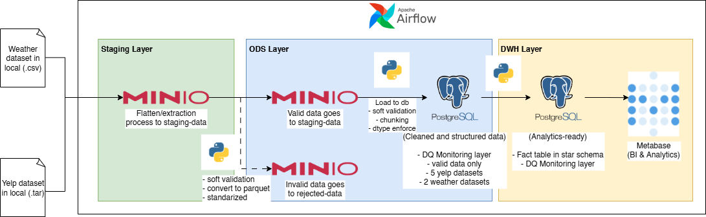
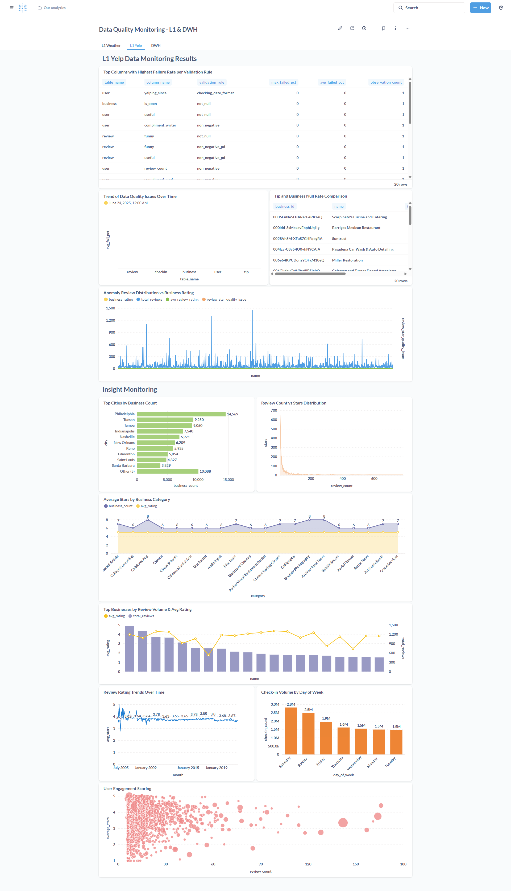
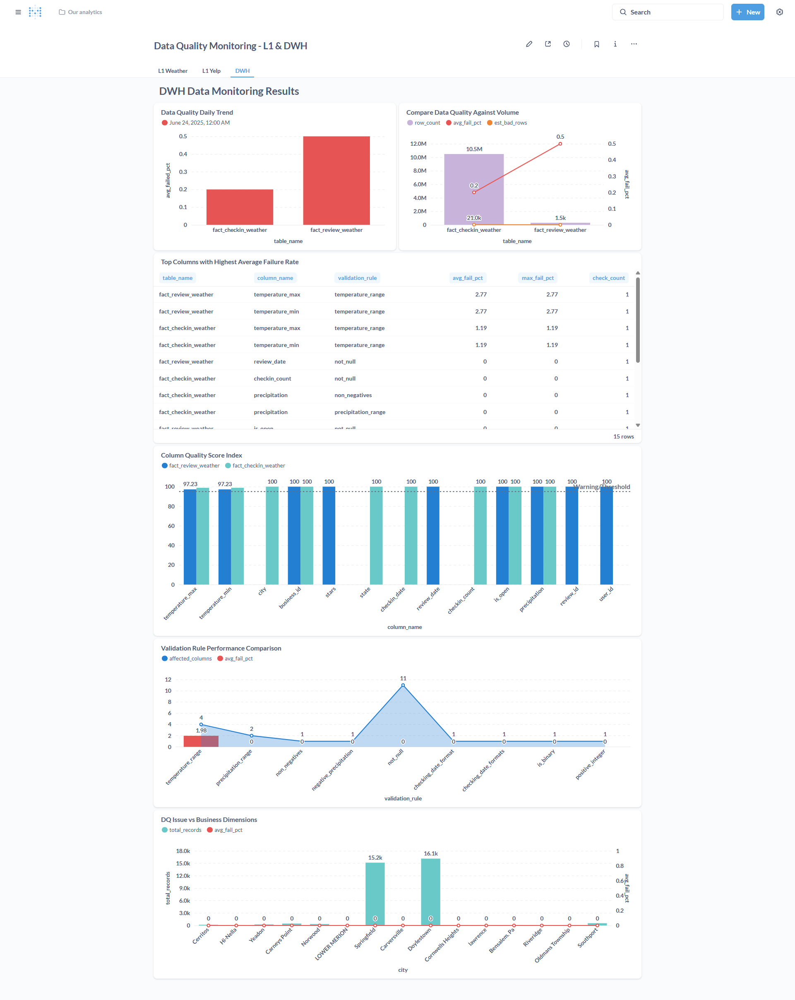

<h1 align="center">🧱 Config-Driven DQ Pipeline — Yelp × Weather</h1>
<p align="center">End-to-end ELT with <b>Apache Airflow</b>, <b>MinIO (S3-compatible)</b>, and <b>PostgreSQL</b> — schema-aware, config-driven validation, rejected lanes, and L1/DWH monitoring via <b>Metabase</b>.</p><br>
<p align="center">
  
  <a href="https://github.com/caesarmario">
    
  </a>
  <a href="https://beacons.ai/caesarmario_">
    
  </a>
  <a href="https://www.kaggle.com/caesarmario">
    
  </a>
</p>
<br>

> **TL;DR**
>
> - **Config-driven DQ** (JSON transforms + rules) across **ODS (L1)** and **DWH (L2)**
> - **8+ Airflow DAGs**: extract (TAR→MinIO), validate (JSON/CSV→Parquet), load ODS, build DWH facts, run monitors
> - **Monitoring**: metrics → `data_monitoring*` schemas; dashboards in **Metabase**
> - **Perf (single-node Docker)**: ~**14.0M rows in ~11 minutes** (~**21K rows/sec**), **12K+ DQ checks/run**

---
## 📃 Table of Contents
- [Features](#features)
- [Architecture](#architecture)
- [Repository Structure](#repository-structure)
- [Quickstart](#quickstart)
  - [1) Prerequisites](#1-prerequisites)
  - [2) Environment](#2-environment)
  - [3) Bring up the stack](#3-bring-up-the-stack)
  - [4) Airflow Variables (UI → Admin → Variables)](#4-airflow-variables-ui--admin--variables)
  - [5) Run DAGs (order)](#5-run-dags-order)
- [Main Modules](#-main-modules)
- [Schema-Aware Config (example)](#-schema-aware-config-example)
- [Data Model](#-data-model)
  - [ODS (L1)](#ods-l1)
  - [DWH (L2)](#dwh-l2)
- [Monitoring & Dashboards](#monitoring--dashboards)
- [Performance & Ops](#performance--ops)
- [Acknowledgements](#acknowledgements)
- [Support me!](#support-me)

---

## 📌 Features

- ⬇ Extract Yelp **TAR** datasets to **MinIO**
- 🔄 Transform **Yelp JSON** & **Weather CSV** → **CSV/Parquet** with config-driven validation
- 🧺 Optional **merge** of chunked CSV → single CSV per entity
- 🛢 Load to **PostgreSQL** (auto DDL + safe **upsert** via temp tables)
- 📊 Build **DWH facts**: `fact_review_weather`, `fact_checkin_weather`
- ✅ **Data Quality** checks on **L1** & **DWH** layers, with rejected lanes & reasons

---

## 🧭 Architecture

<p align="center">
  
</p>


---

## 📂 Repository Structure
```
├─ .github/
│  └─ pull_request_template.md
├─ airflow/
│  ├─ dags/
│  │  ├─ 01_dag_extract_yelp_to_minio.py
│  │  ├─ 02_dag_process_weather_csv_to_minio.py
│  │  ├─ 02_dag_process_yelp_json_to_csv.py
│  │  ├─ 02_dag_process_yelp_json_to_minio.py
│  │  ├─ 03_dag_load_parquet_to_db.py
│  │  ├─ 04_dag_generate_insight_dwh.py
│  │  ├─ 99_dag_dm_checker_l1.py
│  │  └─ 99_dag_dq_checker_dwh.py
├─ assets/
│  ├─ diagrams/
│  │  ├─ data_architeture_diagram.drawio.png
│  │  ├─ diagram_answer.drawio
│  │  ├─ dq_framework.drawio.png
│  │  ├─ erd.drawio.png
│  │  ├─ star_schema_1.drawio.png
│  │  └─ star_schema_2.drawio.png
│  ├─ metabase_sql/
│  │  ├─ dwh_data_monitoring_metabase.sql
│  │  ├─ weather_data_monitoring_metabase.sql
│  │  └─ yelp_data_monitoring_metabase.sql
│  ├─ screenshots/
│  │  ├─ l1_dwh_data_monitoring_dashboard.png
│  │  ├─ l1_weather_data_monitoring_dashboard.png
│  │  └─ l1_yelp_data_monitoring_dashboard.png
├─ data/
│  ├─ weather_raw/
│  │  ├─ precipitation.csv
│  │  └─ temperature.csv
│  └─ yelp_raw/
│     ├─ yelp_dataset.tar
│     └─ yelp_photos.tar
├─ schema_config/
│  ├─ dwh_schema_config/
│  │  ├─ fact_checkin_weather_config.json
│  │  └─ fact_review_weather_config.json
│  ├─ weather_schema_config/
│  │  ├─ precipitation_config.json
│  │  └─ temperature_config.json
│  └─ yelp_schema_config/
│     ├─ business_config.json
│     ├─ checkin_config.json
│     ├─ review_config.json
│     ├─ tip_config.json
│     └─ user_config.json
├─ scripts/
│  ├─ data_monitoring/
│  │  ├─ monitor_data_quality_dwh.py
│  │  └─ monitor_data_quality_l1.py
│  ├─ sql/
│  │  ├─ fact_checkin_weather.sql
│  │  └─ fact_review_weather.sql
│  ├─ utils/
│  │  ├─ etl_utils.py
│  │  ├─ logging_utils.py
│  │  ├─ monitor_utils.py
│  │  ├─ reserved_keywords.json
│  │  └─ validation_utils.py
│  ├─ extract_yelp_to_minio.py
│  ├─ generate_dwh_insight.py
│  ├─ load_parquet_to_db.py
│  ├─ merge_yelp_csv_to_minio.py
│  ├─ process_weather_csv_to_minio.py
│  ├─ process_yelp_json_to_csv.py
│  └─ process_yelp_json_to_minio.py
├─ .env
├─ .gitignore
├─ docker-compose.yml
├─ Dockerfile
├─ README.md
└─ requirements.txt
```


---

## ⚙️ Quickstart

### 1) Prerequisites
- Docker & Docker Compose
- Python 3.10+ (optional for local script runs)
- ±10 GB free disk (datasets + artifacts)

### 2) Environment
Copy `.env` → adjust as needed (or use Airflow Variables).
```env
POSTGRES_HOST=postgres
POSTGRES_PORT=5432
POSTGRES_DB=warehouse
POSTGRES_USER=postgres
POSTGRES_PASSWORD=postgres

MINIO_ENDPOINT=http://minio:9000
MINIO_ROOT_USER=minio
MINIO_ROOT_PASSWORD=minio123
MINIO_BUCKET=staging-data
```

### 3) Bring up the stack
```bash
docker compose up -d
# Airflow: http://localhost:8080 • MinIO: http://localhost:9001 • Postgres: localhost:5432
```

### 4) Airflow Variables (UI → Admin → Variables)
```json
{
  "MINIO_CREDS": {
    "endpoint":"http://minio:9000",
    "access_key":"minio",
    "secret_key":"minio123",
    "bucket":"staging-data"
  },
  "PG_CREDS": {
    "host":"postgres",
    "port":5432,
    "user":"postgres",
    "password":"postgres",
    "database":"warehouse"
  }
}
```

### 5) Run DAGs (order)
1. `01_dag_extract_yelp_to_minio`
2. `02_dag_process_weather_csv_to_minio`
3. `02_dag_process_yelp_json_to_minio` (*optional CSV path: `02_dag_process_yelp_json_to_csv` + `merge_yelp_csv_to_minio`*)
4. `03_dag_load_parquet_to_db`
5. `04_dag_generate_insight_dwh`
6. `99_dag_dm_checker_l1` → `99_dag_dq_checker_dwh`

<p align="center">  </p>

---

## 🔧 Main Modules
### `scripts/utils/etl_utils.py`
- MinIO/PG helpers: connect, upload/download, list/delete
- Dynamic **DDL** from configs (create/alter table)
- **Upsert** via temp tables (idempotent, safe swap)
- Execute DWH SQL with temp-table approach

### `scripts/utils/validation_utils.py`
- Field rules: not_null, stars_range_check, validate_latitude/longitude, positive_integer, etc.
- Cross-column rules: min_less_than_max, normal_min_less_than_max
- Chunk validation → writes **validated** and **rejected** Parquet (with reasons)

### `scripts/utils/monitor_utils.py`
- SQL-driven metrics (passed, failed, failed_pct, row_count)
- 15+ rule types; writes to `data_monitoring*` schemas (L1 & DWH)

---

## 🧩 Schema-Aware Config (example)

### `schema_config/yelp_schema_config/business_config.json`
```json
{
  "latitude": {
    "col_csv": "latitude",
    "dtype": "FLOAT",
    "transformation": "to_numeric",
    "validation": ["not_null", "validate_latitude"]
  },
  "stars": {
    "col_csv": "stars",
    "dtype": "FLOAT",
    "transformation": "to_numeric",
    "validation": ["not_null", "stars_range_check"]
  }
}
```
- 🔁 Auto-transform (numeric/datetime/json)
- ✅ Column & cross-column validation
- 🧺 Rejected lanes with **failed rule** for audit/replay

---

## 🧱 Data Model
### ODS (L1)
- `yelp.business`, `yelp.review`, `yelp.user`, `yelp.tip`, `yelp.checkin`
- `weather.temperature`, `weather.precipitation`

### DWH (L2)
- `dwh.fact_review_weather`
- `dwh.fact_checkin_weather`

<p align="center">  </p>

---

## 📈 Monitoring & Dashboards
- **L1 Monitoring** → `data_monitoring.*_monitoring`
- **DWH Monitoring** → `data_monitoring_dwh.*_monitoring`
- **Metabase** query templates:
  - `assets/metabase_sql/yelp_data_monitoring_metabase.sql`
  - `assets/metabase_sql/weather_data_monitoring_metabase.sql`
  - `assets/metabase_sql/dwh_data_monitoring_metabase.sql`

<p align="center">  </p>

**Example panels**
- Quality Score Index (100 − avg failed%)
- Top failing columns & rules
- DQ vs volume; freshness delay (`load_dt`)
- Distribution drift & outliers (analytical)

---
## 🏎️ Performance & Ops
- ****Throughput**: **~14.0M rows** in **~11 minutes** (**~21K rows/sec**) on a single-node Docker (ThreadPool + chunked I/O)
- **Coverage**: **12K**+ **DQ checks/run** (column × rule) across 7 tables; metrics persisted for trend analysis
- **Gatekeeping**: rejected Parquet + reasons/time for traceability
- **Idempotency**: temp-table upsert, ordered loads, schema evolution

---
## 🙇‍♂️ Acknowledgements
- **Yelp Open Dataset**
- **U.S. Weather CSVs (public)**
- Ecosystem: **Apache Airflow, MinIO, PostgreSQL, Metabase**

---
## 🙌 Support me!

👉 If you find this project useful, **please ⭐ this repository 😆**!
---

👉 _More about myself: <a href="https://linktr.ee/caesarmario_"> here </a>_